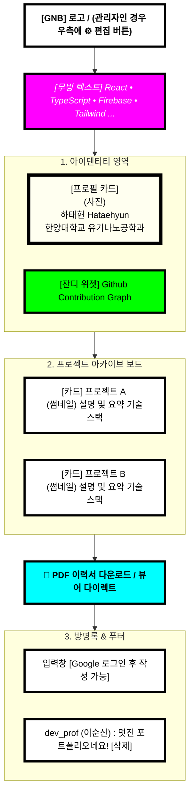

# "마이링크" 와이어프레임 (Wireframe) 설계

## 📌 문서 개요
이 문서는 PRD v1.4를 기반으로 "마이링크"의 웹페이지 화면 구조(UI 배치)와 요소 간의 상호작용 흐름을 Mermaid 다이어그램을 활용하여 시각적으로 설계한 문서입니다.

---

## 1. 메인 프로필 화면 배치도 (디폴트 스크롤 뷰)

---

## UI/UX 설계 요안 (Design Principles 심화)
1. **듀얼 테마 적용방식:** 
   *   **Light 모드 (네오 브루탈리즘):** 크림톤 메인 배경. 선명한 검은색(#000) 외곽선과 그림자, 그리고 시안/마젠타/옐로우 등 높은 채도의 원색을 덩어리로 씁니다.
   *   **Dark 모드 (사이버펑크 네온):** 순수한 검은색(#000) ~ 짙은 회색 배경. 하드 쉐도우는 부드러운 네온 글로우(Glow) 형광색 이펙트로 변환되며, 텍스트는 밝은 녹색 등 해킹 터미널 같은 스타일로 스위칭됩니다.
2. **타이포그래피 및 모션:** 굵고 거친 폰트를 사용하여 무게감을 줌과 동시에 클릭 시 아래로 깊게 눌리는 물리 모션을 추가합니다.
